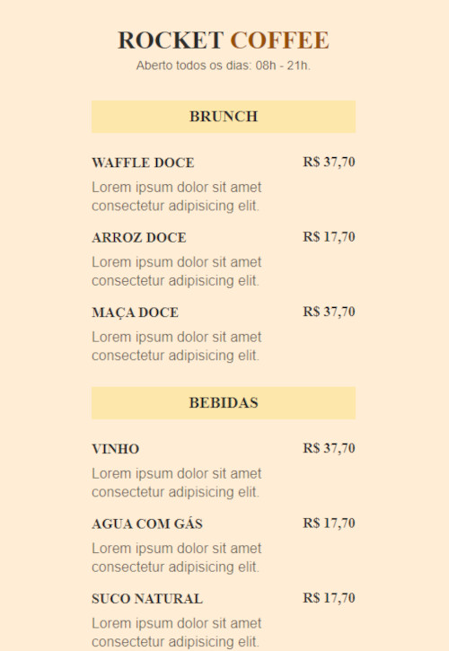

# RocketCoffee

> Maratona Explore

Projeto Construido no evento maratona explore do Rocketseat.

[Clique aui para acessar:](https://thiago-santos-sousa.github.io/RocketCoffee/)

## 	Tecnologias

-HTML
-CSS
-Git e Github

## 	Contato

tthiagnho@gmail.com

Exercício em HTML e CSS. Projeto modelo de um menu  na plataforma  Rocketseat, exercício da maratona explorer 03.
